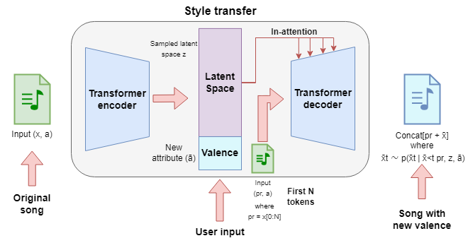
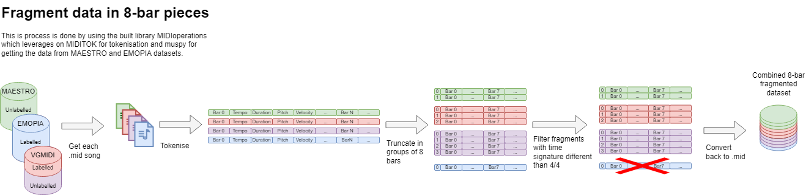
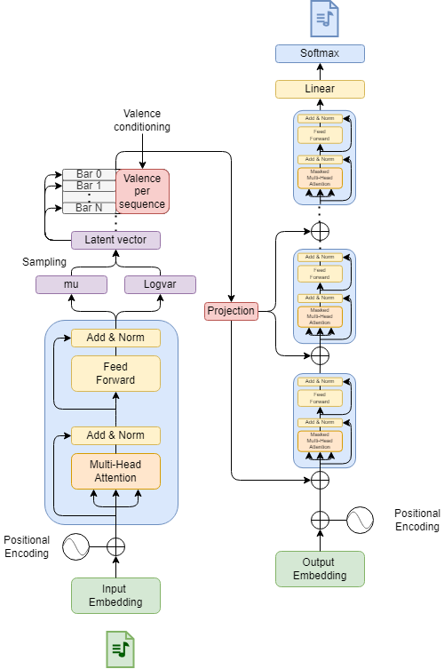

# EmotionWave
Style Transfer Transformer VAE for Emotion Valence in symbolic music generation.

This project aimed to achieve controllability in a high-level feature, such as emotion, more specifically valence, using a transformer VAE called EmotionWave.  

Valence, from Russel's circumplex model of affect (Russel 1980), describes the positivity or negativity conveyed by a piece of music. Examples of a positive valence in music are songs that sound happy, cheerful or euphoric; in the case of negative valence are songs that sound sad, depressing or angry.

## Model general perspective
Given a .mid input and the desired valence of the generated song, EmotionWave generates a new version of the input song but with the desired valence. Valence can be set as 1 or 2 which mean more negative or more positive, respectively. The diagram below shows the general flow of information in the model.

  

## Formating and labelling the data
To train EmotionWave, the scarcity of valence labelled datasets needed to be solved first. The diagrams below show how the dataset was collected and labelled with a corresponding valence.

## EmotionWave model
The diagram below shows the complete EmotionWave model that uses the in-attention mechanisms presented by Wu and Y.-H. Yang (2023) to guide in the generation process with information of the original song and to imbue the desired valence.  

  

In this diagram the "projection" box represents the latent vector with the concatenated desired valence projected to match the dimensions of each of the inputs of the decoders self-attention layers.

## Results
Samples of the generated results can be seen in the generated samples examples. Each song has the original input, the negative generated song with a 1 in the name and the positive generated song with a 2 in the name. 

## Reproduction
To reproduce the results all the .ipynb files need to be run cell by cell in the following order:
1) **FormatDataset_EmotionWave.ipynb** to format the data and compute the valence for each of the songs
2) **Train_emotionWave.ipynb** The created file "data_8bar_ids_dict_clean.pkl" in the previous step needs to be uploaded, then EmotionWave will be trained. It takes around 24 hours to be trained (20 epoch) using 8GB of memory in a NVIDIA A100.
3) **Generate_EmotionWave.ipynb** The trained model and the cleaned dataset need to be uploaded: "data_8bar_ids_dict_clean.pkl" and "Models_20_0.73625825994310780.29909917901890815" after this songs can be generated either from the dataset or by uploading the desired song. Evaluation metrics can be run in this file too. 

"data_8bar_ids_dict_clean.pkl" is already provided in the Pickle folder, so if this one is used just steps 2 and 3 need to be run.

** As future work, we intend to improve the reproducibility of the results by adapting the .ipynb files to .py files and remove all the redundant code.

** The trained model was not uploaded due to space, it measures around 300Mb, (we plan to investigate if there is a way to upload a file of this size to another platform)

## References
Russell, James A. (1980). “A circumplex model of affect”. In: Journal of Personality and Social Psychology 39.6. Place: US Publisher: American Psychological Association, pp. 1161–1178. ISSN: 1939-1315. DOI: 10.1037/h0077714.

Wu, Shih-Lun and Yi-Hsuan Yang (2023). “MuseMorphose: Full-Song and Fine-Grained Piano Music Style Transfer With One Transformer VAE”. In: IEEE/ACM Transactions on Audio, Speech, and Language Processing 31. Conference Name: IEEE/ACM Transactions on Audio, Speech, and Language Processing, pp. 1953–1967. ISSN: 2329-9304.DOI: 10.1109/ TASLP.2023.3270726. URL: https://ieeexplore.ieee.org/abstract/document/10130842 (visited on 07/22/2024).

